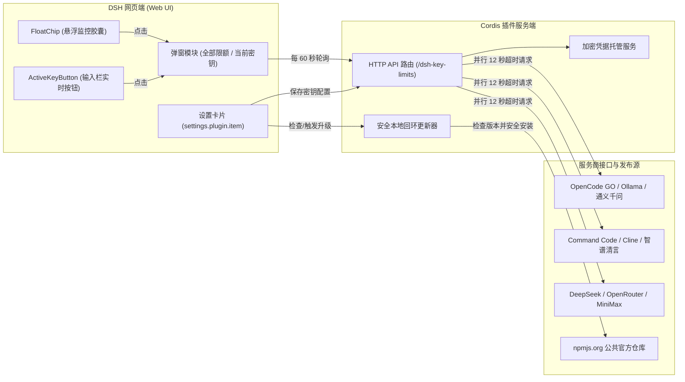

# 📦 @goodandready/dsh-key-limits

<div align="center">

<h3>DeepSeek Harness 智能体 API 密钥额度、Token 计划与订阅余额实时监控插件</h3>

<p align="center">
  <a href="https://www.npmjs.com/package/@goodandready/dsh-key-limits"></a>
  <a href="LICENSE"></a>
  <a href="https://github.com/topics/dsh-plugin"></a>
  <a href="https://nodejs.org"></a>
</p>

<!-- 作者所有项目直达按钮 -->
<p align="center">
  <a href="https://goodandready.app/"></a>
</p>

<p align="center">
  <a href="README.md"><b>🇬🇧 English</b></a> •
  <a href="README.zh.md"><b>🇨🇳 中文说明</b></a> •
  <a href="README.ru.md"><b>🇷🇺 Русский</b></a>
</p>

<!-- 项目支持模块 -->
<table align="center">
  <tr>
    <td align="center">
      ⭐ <strong>如果您喜欢这个插件，请在 GitHub 上为它点亮 Star</strong> — 这能让我知道插件对您有用，并鼓励我继续开发和维护它。
      <br><br>
      🐛 <strong>如果您发现 Bug 或希望增加功能</strong>，请使用任意语言在 GitHub 上提交 Issue — 我会评估您的建议，并在后续版本中实现有价值的改进。
    </td>
  </tr>
</table>

</div>

---

## ⚡ 概述与核心痛点

AI 开发者和工程师在日常工作中通常需要同时跨多个主流模型服务商与订阅计划（如 OpenCode GO、Ollama Cloud、通义千问 Qwen Cloud、Kimi、智谱清言 GLM、MiniMax、Cline、DeepSeek、OpenRouter 以及 Command Code）。

在 DeepSeek Harness (DSH) 中缺少全局配额状态监控时：
- 会话在代码生成进行到一半时因 5 小时滚动窗口或每月配额枯竭而异常中断报错。
- 难以直观判断当前会话激活模型究竟绑定了哪一个具体的密钥账户。
- 频繁在几十个各厂商后台网页间来回切换查询，割裂开发心流。

`dsh-key-limits` 专为解决此痛点而生，在 DSH Web 工作区提供免打扰、沉浸式的实时配额与余额监控。插件专注核心剩余状态，不引入沉重的财务账目或统计报表。

---

## 🏗️ 架构与数据流



---

## ✨ 核心特性详解

### 1. 悬浮监控胶囊 (`FloatChip`)
- **视口全局悬浮**：显示当前所有配置账户中最紧缺的配额百分比（或配置的账户总数）。
- **自由拖拽与边缘保护**：支持平滑鼠标/触摸拖拽，内置视口碰撞检测，绝不滑出屏幕。坐标自动保存于 `localStorage`。
- **一键速查**：点击胶囊立即打开**全部限额详情弹窗**，直观展示 9 个账户的健康度、额度条与刷新时间。

### 2. 对话输入栏集成 (`ActiveKeyButton`)
- 嵌入消息输入面板 (`conversation.composer.bar`，优先级 10)。
- 实时侦测当前对话所绑定的模型供应商。
- 精准呈现该模型对应订阅的剩余百分比或金额余额。
- 点击按钮打开仅针对该活跃账户的详情弹窗。

### 3. 账户排序与活跃账户置顶
- **自定义显示顺序 (`order`)**：在设置中心，使用简洁直观的 ▲ / ▼ 按钮上下移动调整卡片先后排列。
- **活跃账户自动置顶 (`activeOnTop`)**：当前聊天所调用的账户将自动固定至列表第一位。默认开启。

### 4. 人性化重置倒计时 (`fmtReset`)
- 距离重置超过 24 小时：格式化显示天、小时与分钟（例如 `5d 5h 19m`）。
- 不足 24 小时：简明显示小时与分钟（例如 `4h 59m`）。
- 已过期的窗口即时标明需刷新状态。

### 5. 克制优雅的视觉风格
- 卡片间统一定义 **12px** 垂直间距，杜绝元素贴边与边框压叠。
- 充足状态 (>30%) 采用温和的中性主题色，预警黄 (<30%) 与危急红 (<15%) 仅在真正紧缺时出现。
- 5px 高度的高端精致进度条。

### 6. 内置一键版本更新
- 在设置卡片内直接检测 npm 官方最新版本。
- 自动化调用安装程序升级至确定版本，无需手动开启终端执行 shell 指令。
- 严格限制为 Loopback 本地同源请求，保障系统安全。

---

## 🔌 支持的服务商一览

| 服务商 ID | 名称 | 配额窗口类型 | 鉴权方式 |
|-----------|------|-------------|---------|
| `commandcode` | Command Code | 滚动 5小时 / 每周 / 每月 (GOAT, Pro, Max 计划) | API 密钥 (`user_...` 或令牌) |
| `opencode-go` | OpenCode GO | 滚动 5小时 / 每周 / 每月 | 会话 Cookie (`auth`) 与 Workspace ID |
| `ollama` | Ollama Cloud | 会话 / 每周 / 每月 | API 密钥与会话 Cookie |
| `qwen` | 通义千问 (Qwen Cloud) | 5小时 / 1周 Token 计划 | 会话 Cookie 与可选 `sec_token` |
| `kimi` | Kimi for Coding | 每周调用额度限制 | API 密钥 (`sk-kimi-...`) |
| `glm` | 智谱清言 (GLM / Z.ai) | 每日 / 每月额度 | 个人中心 API 密钥 |
| `minimax` | MiniMax Coding Plan | 编程计划专属配额 | API 密钥 (`sk-cp-...`) |
| `cline` | Cline | 5小时 / 每周 / 每月 | Bearer API 令牌 |
| `deepseek` | DeepSeek | 账户资金余额 ($ / ¥) | API 密钥 (`sk-...`) |
| `openrouter` | OpenRouter | 账户代币余额 ($ credits) | API 密钥 (`sk-or-...`) |

---

## 📦 快速安装

在活动的 DSH 运行环境中安装官方公开发布包：

```bash
dsh plugin --profile web add @goodandready/dsh-key-limits
```

重启 DSH Web 服务：

```bash
dsh web --profile web
```

---

## ⚙️ 配置参数指南 (`settings.yaml`)

```yaml
# ~/.dsh/profiles/web/settings.yaml
plugins:
  '@goodandready/dsh-key-limits':
    storageDir: ~/.dsh/storages/dsh-key-limits
    refreshIntervalMs: 60000
    activeOnTop: true
    order: []
```

### 参数说明

| 配置字段 | 类型 | 默认值 | 详细说明 |
|---------|------|-------|---------|
| `storageDir` | `string` | `~/.dsh/storages/dsh-key-limits` | 存放订阅配置与卡片缓存文件 `subs.json` 的目录路径。 |
| `refreshIntervalMs` | `number` | `60000` (1 分钟) | 后台静默轮询第三方服务商配额的间隔时间（毫秒）。 |
| `activeOnTop` | `boolean` | `true` | 是否自动将当前会话关联的模型账户固定至卡片列表顶部。 |
| `order` | `string[]` | `[]` | 用户手动指定的订阅卡片顺序 ID 列表。 |

---

## 🛠️ 开发与测试构建

```bash
# 从 src/client/ 构建打包一体化客户端脚本
npm run build:client

# 运行自动化测试套件
npm test
```

### 项目结构

```
.
├── lib/
│   ├── index.js          # Cordis 插件入口与服务端路由
│   ├── client.js         # 打包生成的客户端脚本
│   ├── cards.js          # 配额卡片组装与格式化
│   ├── subs.js           # 服务商数据抓取与标准归一化
│   ├── paths.js          # 路径处理辅助函数
│   └── plugin-updater.js # 安全本地更新器
├── src/client/           # 浏览器端源码模块
│   ├── 01-prelude.js     # 样式隔离定义与 React 绑定
│   ├── 02-locale.js      # 多语言支持字典 (en, zh, ru)
│   ├── 03-format.js      # 时间格式化、百分比与颜色映射
│   ├── 04-modals.js      # 全局弹窗与单项卡片弹窗
│   ├── 05-bar.js         # 输入框实时按钮 ActiveKeyButton
│   ├── 06-float.js       # 悬浮监控胶囊 FloatChip
│   ├── 07-settings.js    # 设置面板、排序组件与升级器
│   └── 08-apply.js       # 插件客户端启动与插槽装配
├── cordis.patch.yml      # Cordis 扩展补丁配置
└── test/                 # 自动化测试脚本
```

---

## 📄 开源协议

MIT © [GooDAnDReaDY](https://github.com/GooDAnDReaDY)
